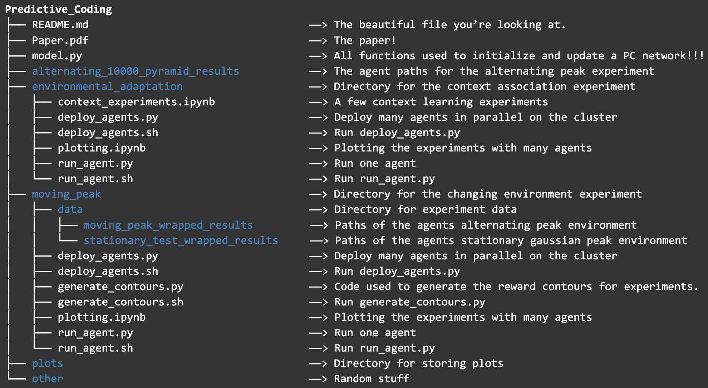

# Predictive_Coding
***Collaborators: Chenguang Li, Jonah Brenner, and Adam Boesky***

This project explores a variation of the predictive coding (PC) model's capacity to:
1. Adapt to a changing reward landscapes.
2. Learn association.

This project was done as part of Harvard's **APPHY 286 - Inference, Information Theory, Learning and Statistical Mechanics** course taught by Sharad Ramanthan.

## Repository Structure:
The following is a breakdown of our repository and its contents.
